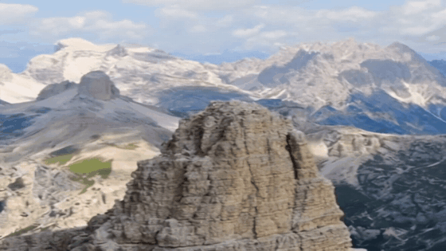
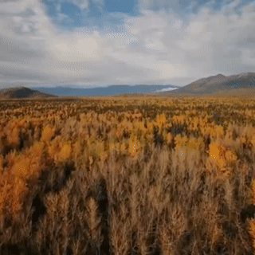
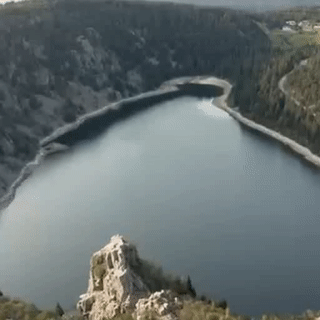
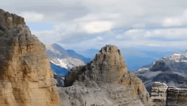
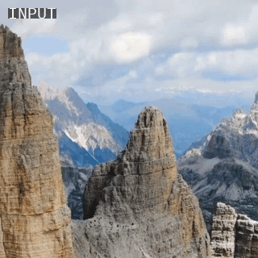
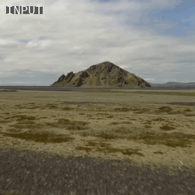

# Makeitalive: Landscape Picture Animation

<p align="center">
  
  <br>
  <em>A single static landscape photo brought to life by our LoRA fine-tuned Stable Video Diffusion model.</em>
</p>

<p align="center">
    <a href="docs/report.pdf"><b>Report</b></a> &nbsp;·&nbsp;
    <a href="docs/poster_1.pdf"><b>Poster 1</b></a> &nbsp;·&nbsp;
    <a href="docs/poster_2.pdf"><b>Poster 2</b></a>
</p>

## Project Overview

**Makeitalive** is a computer vision and generative AI project developed by Arthur Fournier and Mathurin Petit for the `CSC_52002 - Generative AI Project` course at Ecole Polytechnique. The goal of this project is to breathe life into static landscape photographs by animating them into realistic video sequences. We explored and implemented two distinct methodologies:

1. **Motion Flow (Warping):** A lightweight, self-supervised U-Net architecture that predicts a dense `(dx, dy)` optical flow field from a single image. The model displaces existing pixels to synthesize motion. It is exceptionally fast but lacks the ability to generate new visual details for occluded areas and is not suitable for realistic animation.
2. **Stable Video Diffusion (SVD):** A generative approach built on Stability AI's `stable-video-diffusion-img2vid`, whose temporal attention layers are fine-tuned with **LoRA** (`diffusers` + `peft`) on a curated dataset of drone landscape footage. This heavy-weight approach successfully hallucinates rich textures and sweeping, cinematic parallax motion from a single static input.

---

## Results

### 1. Naive approach: Motion Flow warping

The U-Net predicts a flow field that is applied iteratively to the input image. Motion is plausible for textures like wheat or water, but no new content can be created.

| Wheat | Lake |
|:---:|:---:|
|  |  |

### 2. Stable Video Diffusion, out of the box

The pretrained SVD model without any fine-tuning: the motion is short and does not produce the drone-like camera movement we are looking for.

<p align="center">
  
</p>

### 3. Stable Video Diffusion, LoRA fine-tuned on drone landscapes

After fine-tuning on landscape drone clips, the model produces smooth camera motion with convincing parallax and generates the newly revealed parts of the scene.

| | |
|:---:|:---:|
|  |  |

<p align="center">
  
</p>

---

## Project Architecture

```plaintext
Makeitalive/
├── assets/
│   ├── gifs/                   # Animated results shown in this README
│   ├── images/                 # Sample input picture (landscape.jpg)
│   └── videos/                 # Full-quality result videos (motion_flow/, svd/)
├── docs/                       # Final report (CVPR format) and the two project posters
├── notebooks/
│   ├── data/                   # Dataset exploration and filtering checks
│   ├── motion_flow/            # Motion Flow prototyping, evaluation, inference and Colab training
│   └── svd/                    # SVD LoRA fine-tuning & inference (Colab and local GPU versions)
└── src/
    ├── data/                   # YouTube download, image-pair extraction and PyTorch dataset
    ├── motion_flow/            # Motion Flow U-Net model and training loop
    └── svd/                    # SVD clip extraction and LoRA fine-tuning / inference
```

---

## Installation

The project uses [uv](https://docs.astral.sh/uv/).
```bash
uv sync                 # Motion Flow + data tooling
uv sync --extra svd     # + diffusers, transformers, accelerate, peft for SVD
```
Downloaded videos, datasets and checkpoints are stored locally in `data/` and `checkpoints/` (git-ignored).

---

## Important Commands

### 1. Download YouTube Drone Landscapes
Download a large compilation drone video (e.g., *10 Hours Fantastic Views of Nature 4K*) to build your dataset.
```bash
uv run src/data/download_youtube.py \
    --url "https://www.youtube.com/watch?v=AKeUssuu3Is" \
    --out "./data/10hourslandscape.mp4"
```

### 2. Make Dataset (From Local Video)
Extract consecutive, motion-filtered image pairs from a downloaded video with strict thresholds to drop montage cuts.
```bash
uv run src/data/make_dataset_video.py \
    --video "./data/10hourslandscape.mp4" \
    --name "dataset_local" \
    --interval 5.0 \
    --gap 4 \
    --size 512 \
    --max_pairs 100 \
    --clean
```

### 3. Make Dataset (Direct from YouTube)
Stream and extract the training pairs directly without downloading the full video first.
```bash
uv run src/data/make_dataset_youtube.py \
    --url "https://www.youtube.com/watch?v=AKeUssuu3Is" \
    --name "ytb_gap3_interval5dot0_clean" \
    --interval 5.0 \
    --gap 3 \
    --size 512 \
    --max_pairs 5000 \
    --clean
```

### 4. Training the Motion Flow Model
Start self-supervised training of the MotionFlow U-Net using the extracted pairs.
```bash
uv run src/motion_flow/train.py \
    --epochs 100 \
    --batch_size 8 \
    --lr 1e-4 \
    --num_workers 16
```

### 5. Make the SVD Clip Dataset
Extract short, motion-filtered 14-frame clips (scene cuts removed) for SVD fine-tuning.
```bash
uv run src/svd/make_dataset_svd.py \
    --url "https://www.youtube.com/watch?v=AKeUssuu3Is" \
    --out "./data/svd_landscape" \
    --clip_len 14 \
    --fps 7 \
    --size 512 \
    --max_clips 5000
```

### 6. Fine-tune SVD with LoRA and Run Inference
Fine-tune the temporal attention layers of SVD (an A100-class GPU is recommended; the SVD weights are downloaded from Hugging Face).
```bash
uv run src/svd/train_svd_lora.py \
    --data_dir "./data/svd_landscape" \
    --output_dir "./checkpoints/svd_lora" \
    --epochs 3 \
    --batch_size 1 \
    --lora_rank 16
```
Animate a picture with a trained LoRA (the result is written to `output.mp4`):
```bash
uv run src/svd/train_svd_lora.py --infer \
    --lora_dir "./checkpoints/svd_lora/run_<timestamp>/lora_best" \
    --image_path "./assets/images/landscape.jpg"
```

---

## Authors

- **Arthur Fournier**
- **Mathurin Petit**
